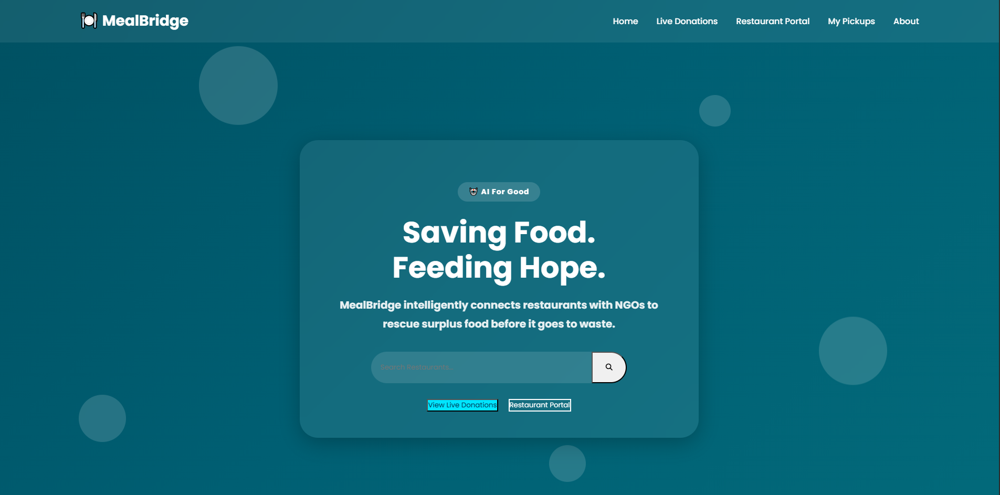
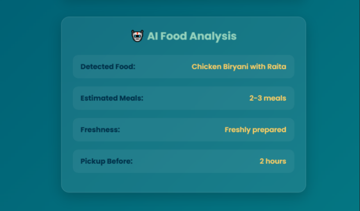
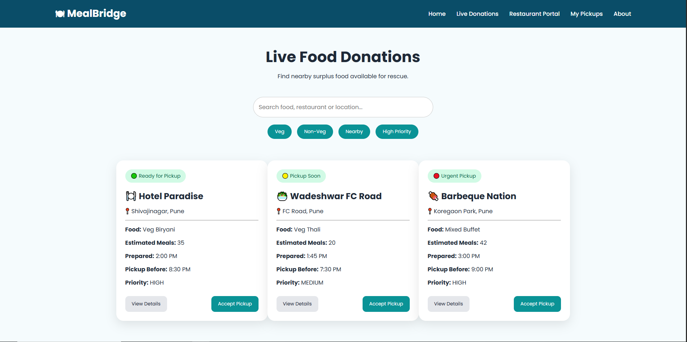
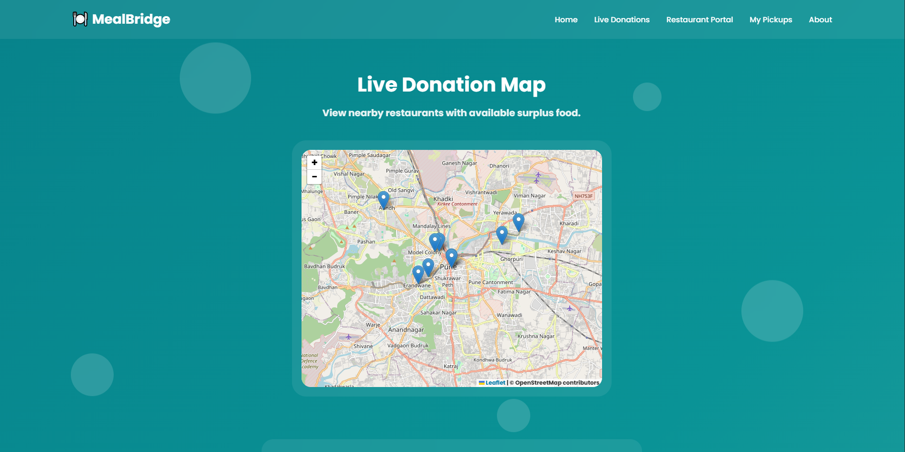
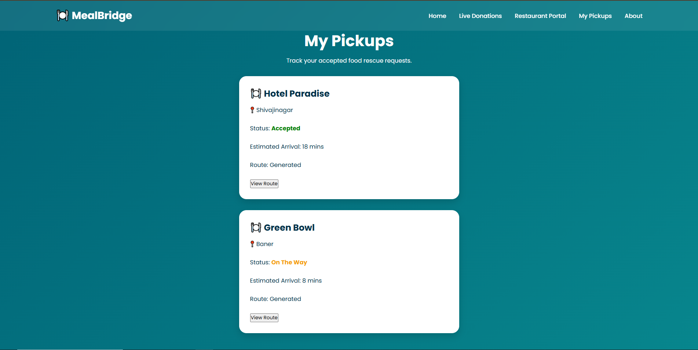
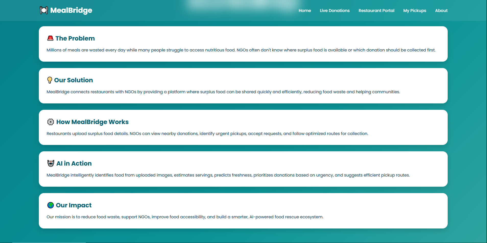

# 🍽️ MealBridge

## AI-Powered Food Rescue Platform

MealBridge is an AI-powered web application developed for the **AI for Good Hackathon 2026**. The platform connects restaurants with NGOs to reduce food waste by making surplus food donations faster, smarter, and more efficient.

Restaurants can upload details of surplus food, while NGOs can discover nearby donations and accept pickups before the food goes to waste. Integrated AI analyzes uploaded food images to provide valuable insights such as food type, estimated meals, freshness, and recommended pickup time.

---

# 🌍 Problem Statement

Millions of meals are wasted every day by restaurants, hotels, and catering services, while many people continue to face food insecurity. NGOs often struggle to identify available food donations quickly enough before the food becomes unsuitable for consumption.

There is a need for a smart platform that efficiently connects food donors with organizations that can distribute surplus food to those in need and dont have any source of food.

---

# 💡 Our Solution

MealBridge provides a centralized platform where:

- 🍽️ Restaurants can register food donations.
- 🤖 AI analyzes uploaded food images automatically.
- 📍 NGOs can view nearby available food donations.
- 🚚 NGOs can accept pickups before food expires.
- ❤️ Food reaches people instead of landfills.

---

# ✨ Key Features

## 🏠 Home Dashboard

- Modern and responsive landing page
- Search nearby restaurants
- Interactive donation map
- Daily impact statistics
- Simple and user-friendly interface

---

## 🍴 Restaurant Portal

Restaurants can:

- Enter donation details
- Upload food images
- Receive instant AI-powered food analysis

The AI automatically provides:

- 🍛 Food Identification
- 🍽️ Estimated Number of Meals
- 🥗 Freshness Prediction
- ⏰ Recommended Pickup Time

---

## 📦 Live Donations

NGOs can:

- Browse available food donations
- View restaurant details
- Check food quantity
- View pickup deadlines
- Prioritize urgent donations

---

## 🚚 My Pickups

- Track accepted pickups
- View pickup history
- Access route information

---

## ℹ️ About

Provides information about:

- MealBridge's mission
- Objectives
- Food waste awareness
- Social impact

---

# 🤖 AI Integration

MealBridge uses **Google Gemini AI** to analyze uploaded food images.

The AI examines the uploaded image and predicts:

- 🍛 Food Type
- 🍽️ Estimated Meals
- 🥗 Freshness Status
- ⏰ Recommended Pickup Window

This enables NGOs to make faster and better decisions during food rescue operations.

---

# 🛠️ Tech Stack

### Frontend

- HTML5
- CSS3
- JavaScript

### Backend

- Node.js
- Express.js
- Multer

### Artificial Intelligence

- Google Gemini API

### Maps

- Leaflet.js
- OpenStreetMap

### Version Control

- Git
- GitHub

---

# 📂 Project Structure

```text
MealBridge/
│
├── css/
├── js/
├── images/
├── server/
│
├── index.html
├── donate.html
├── donations.html
├── history.html
├── about.html
│
└── README.md
```

---

# 🚀 Getting Started

### 1. Clone the repository

```bash
git clone https://github.com/your-username/MealBridge.git
```

### 2. Navigate to the project

```bash
cd MealBridge
```

### 3. Install dependencies

```bash
npm install
```

### 4. Configure Environment Variables

Create a `.env` file inside the `server` folder and add:

```env
GEMINI_API_KEY=YOUR_API_KEY
```

### 5. Start the backend server

```bash
node server.js
```

### 6. Run the frontend

Open the project using **Live Server** in VS Code.

---
# 📸 Project Screenshots

<table>
<tr>
<td align="center"><strong>🏠 Home Page</strong></td>
<td align="center"><strong>🤖 AI Food Analysis</strong></td>
</tr>

<tr>
<td></td>
<td></td>
</tr>

<tr>
<td align="center"><strong>📍 Live Donations</strong></td>
<td align="center"><strong>🗺️ Live Map</strong></td>
</tr>

<tr>
<td></td>
<td></td>
</tr>

<tr>
<td align="center"><strong>🚚 My Pickups</strong></td>
<td align="center"><strong>ℹ️ About Page</strong></td>
</tr>

<tr>
<td></td>
<td></td>
</tr>
</table>

# 👥 Team Humanova

- **Siman Mulani**
- **Bhagyashree Patil**
- **Sidhika Pandilwar**

---

# ❤️ Built For

**AI for Good Hackathon 2026**

Reducing food waste through Artificial Intelligence and community collaboration.

---

## ⭐ Thank You

Every rescued meal is one step toward reducing food waste and helping communities.

**Together, let's build a future where good food never goes to waste. 🌍❤️**